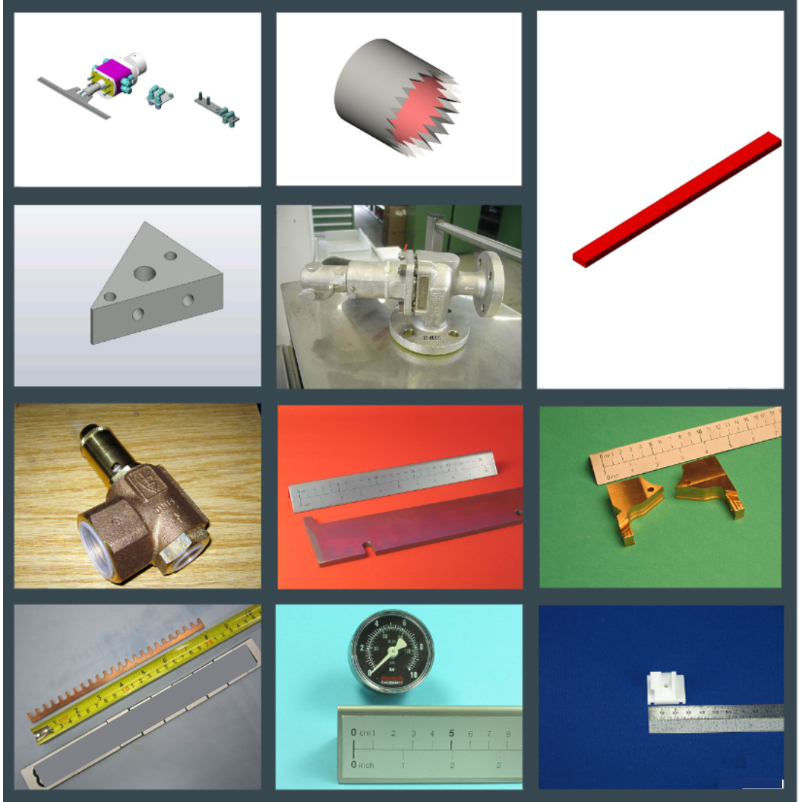
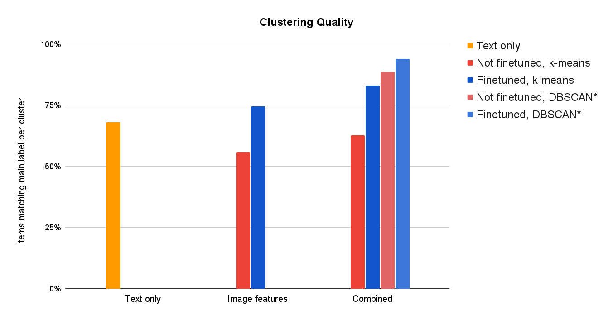

# Image and Text-based Clustering for Industrial Machine Parts 

This repository contains the implementation of a solution to automate the grouping of similar spare parts from a large database. The project addresses the challenge of efficiently categorizing spare parts using both textual and image data.

The project was done in collaboration with [Syrus](https://syrus.ch/).   
The public blogpost can be found on [Constructor website](https://academy.constructor.org/blog/data-science-capstone-projects-batch-24).

## Authors

[Pedro Iglesias De La Vega](https://www.linkedin.com/in/pedroig/),
[Maria Salfer](https://www.linkedin.com/in/ria-salfer/), and
[Naveen Chand Dugar](https://www.linkedin.com/in/naveen-chand-dugar/)

## Supervisors

[Ekaterina Butyugina](https://www.linkedin.com/in/ekaterina-butyugina/) and
[Dipanjan Sarkar](https://www.linkedin.com/in/dipanjans/) 

## Purpose 

Automate the grouping of similar spare parts from a large database using images and other metadata. 

## Data 

Confidential company data. The data includes item names in German and English (cleaned and not), with images for around 55% of the parts. Images have varying backgrounds, sizes, and may contain unwanted elements like rulers or measuring tapes. Some of the items also have weights and entity numbers. All the items have true labels (family and sub-family).



## Requirements

The [Environment](environment.yml) file contains all the necessary python packages for the local Conda environment (see [Installation Instructions](#installation-instructions)). GPU intensive notebooks were run on Kaggle or Google Colab. It is indicated on top of each notebook where it runs.

## Our Approach

### Part 1. Processing the data

Removed items with absolutely no information.
Filled missing names using corresponding names in the other language or manual intervention.
Applied segmentation (LangSAM) to remove unwanted elements from some images (after two rounds of pre-clustering with k-means).

### Part 2. Feature Extraction

**Text Data**: Used various Natural Language Processing techniques like Bag-of-Words, TF-IDF, and sentence transformers to extract information from item names.\
**Image Data**: Employed Convolutional Neural Networks (ResNet50, VGG16) for feature extraction from images, using pre-trained weights and after fine-tuning on the given images and labels.

### Part 3. Clustering

Clustered parts based on:

* Text features only
* Image features only
* Combined features (text and image)

Used k-means as well as a density-based clustering algorithm, DBSCAN, removing noise-labeled data points for optimal results.

## Results

Achieved over 70% overall performance, significantly improving Syrus' current manual process.
Combining text and image features yielded the best results.
Fine-tuning models before clustering further enhanced performance.
Performance may vary depending on the similarity of parts to the training data.


*Performance after removing data samples clustered as “noise”, between 1.8k and 3k data samples left

## How to use this repo
Final notebooks include:
* [data_exploration_and_cleaning.ipynb](notebooks/data_exploration_and_cleaning.ipynb): Basic data exploration and cleaning, including handling missing data, adding useful columns and image statistics.
* [text_features_extraction.ipynb](notebooks/text_features_extraction.ipynb): Extracting feature vectors from the text file name. It uses both Bag of Words approach and Sentence Transformer. 
* [image_segmentation.ipynb](notebooks/image_segmentation.ipynb): Removing the rulers, measuring tapes and other background noise from the images using LangSAM.
* [image_feature_extraction_vgg16.ipynb](notebooks/image_feature_extraction_vgg16.ipynb) and [image_feature_extraction_resnet50.ipynb](notebooks/image_feature_extraction_resnet50.ipynb): Image feature extraction using VGG16 and ResNet50 models, respectively, clustering with k-means and evaluation of different parameters.
* [finetuning-vgg16.ipynb](notebooks/finetuning-vgg16.ipynb) and [finetuning-resnet50.ipynb](notebooks/finetuning-resnet50.ipynb): Fine-tuning pretrained VGG16 and ResNet50 models, respectively, using complete data set and extracting image feature vectors.
* [combined-clustering.ipynb](notebooks/combined-clustering.ipynb): Combines image features and text features to do clustering with best performing algorithms (k-means and DBSCAN). It uses both Bag of Words approach and Sentence Transformer.
* [finetuning_resnet50-combined_clustering-evaluation.ipynb](notebooks/finetuning_resnet50-combined_clustering-evaluation.ipynb): Fine-tuning ResNet50 models using different data subsets and evaluation of k-means clustering based on respective image and text (Sentence Transformer) features.

## Installation Instructions
<a name="installation-instructions"></a>
### 1. Clone project repo to your desired destination 

### 2. Make an environment with conda
`conda create --name syrus`

Activate the environment\:

`conda activate syrus`

### 4. Create the environment from the environment.yml file

`conda env create -f environment.yml`

Remove environment if needed:

`conda remove --name syrus --all`

### 4. Environment Installation From Scratch
#### Local Version
```
conda create --name syrus python=3.11 -y
conda activate syrus 
conda install conda-forge::jupyterlab -y
python -m ipykernel install --user --name=syrus

conda install conda-forge::matplotlib -y
conda install anaconda::scikit-learn -y
conda install anaconda::seaborn -y

pip install tensorflow[and-cuda]
```

#### Kaggle Version - for loading some Pickle files created on Kaggle
```
conda create --name syrus_kaggle python=3.10.13 -y
conda activate syrus_kaggle
conda install conda-forge::jupyterlab -y
python -m ipykernel install --user --name=syrus_kaggle

conda install conda-forge::matplotlib -y
conda install anaconda::scikit-learn -y
conda install anaconda::seaborn -y

pip install tensorflow[and-cuda]
```


